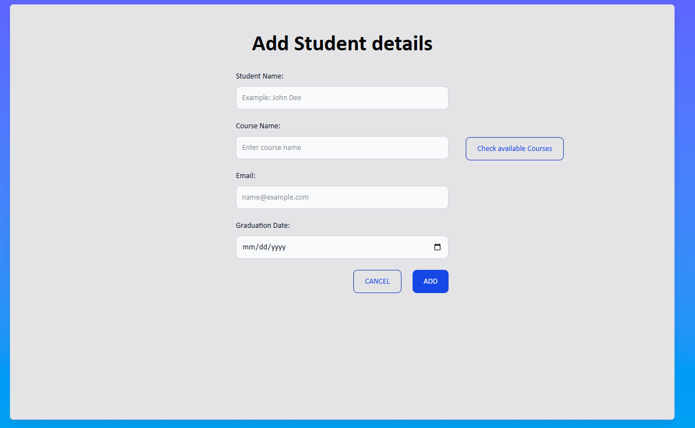

# Student Management Form  

This project is a simple **Student Management System** built with HTML, JavaScript, and Tailwind CSS. It allows users to **enter student details** through a form and dynamically display them in a table.  

### Features:
- **Add Student Details**: Users can input student information, which is dynamically added to the table upon clicking the "Add" button.  
- **Delete Functionality**: Each row has a "Delete" button to remove student entries individually.  
- **Local Storage**: Student data is stored in the browser's local storage for persistence.  
- **Navigation**: A "Cancel" button lets users go back to the table view.  
- **External File Handling**: Uses the **BOM (Browser Object Model)** property `window.open()` to display external files.  
- **Tailwind CSS**: Ensures a clean and modern UI.  

This project demonstrates DOM manipulation, event handling, and data persistence using local storage. 🚀

